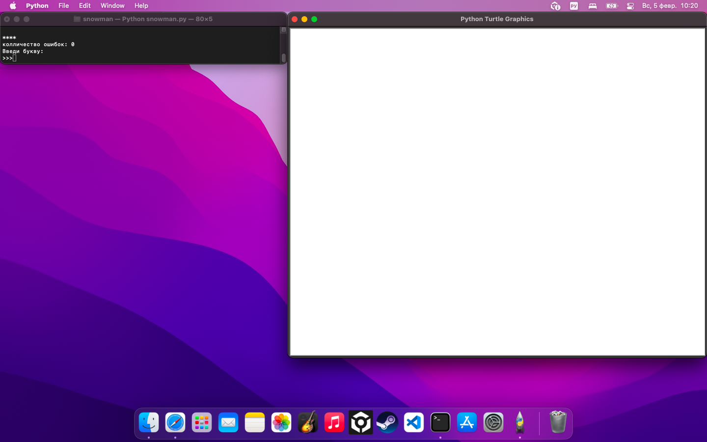
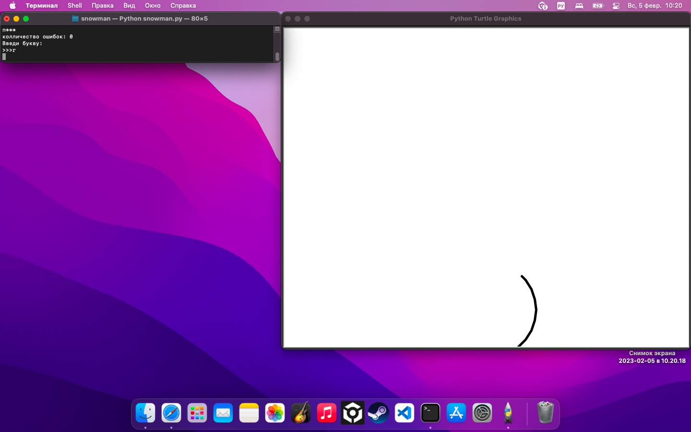

# snowman

Разработан в развликательных целях

## Краткое описание
Это игра под названием сниговик. 
Загодавается слово , ваша задача его угодать,
при помощи подбора букв,
но помните у вас ограниценное количество попыток

## Функционал 
|                |                                |
| -------------  | -----------------------------  |
| генерация слова| автоматическое действие        |
| ввод буквы     | проверка есть ли буква в слове |
| определение победы/поражения|  автоматическое действие | 

## Скриншоты 
</img>
</img>

## Как запустить
скачать файл
после этого ввести комнаду для запуска игры(в командной строке) 
```bash
    python3 snowman.py
```

## Авторство
[Enion(Эрнест Назмутдинов)](https://github.com/En1on)
